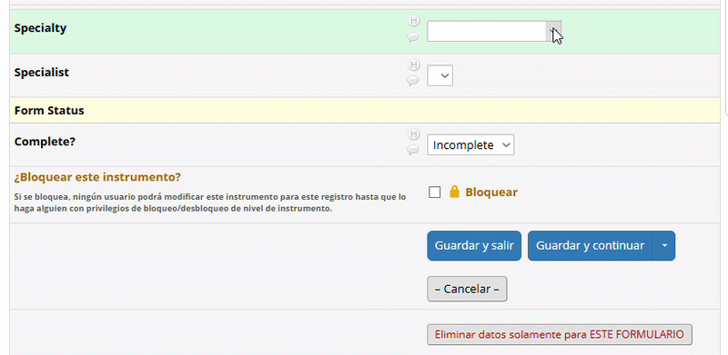

# REDCap Dependent Dropdown

Reusable JavaScript solution for creating **dependent dropdown fields in REDCap** using an External Module such as **Shazam**.

## Quick start

1. Add both fields in REDCap:
   - controlling variable
   - dependent dropdown

2. Paste the JavaScript into your External Module (e.g., Shazam)

3. Edit:
   - variable_controladora
   - variable_dependiente
   - mapa_opciones

## Overview

REDCap does not natively support dynamic filtering of choices within the same dropdown field.

This script allows you to:

- use one **controlling variable**
- dynamically filter the choices of one **dependent dropdown**
- avoid creating one field per category
- reuse the same logic in other REDCap projects

## How it works

The script:

1. reads the selected value from a **controlling variable**
2. looks up the allowed options in a mapping object
3. rebuilds the **dependent dropdown**
4. keeps the current value only if it is still valid

## Requirements

- REDCap
- A way to inject JavaScript into the form page  
  (for example, **Shazam** or another External Module)
- The dependent field must be a **Dropdown List**

## Files

- `redcap_dependent_dropdown.js`: reusable JavaScript template
- 

## How to use

### 1. Add both fields to your REDCap instrument

- **Controlling variable**  
  Example: `especialidad`

- **Dependent variable**  
  Example: `nombre_especialista`

The dependent variable should contain all possible dropdown choices in REDCap.

### 2. Paste the JavaScript into your External Module

For example, if you are using Shazam, paste the code into the module's custom JavaScript section.

### 3. Edit these 3 parts of the script

#### A. Controlling variable
```javascript
var variable_controladora = 'especialidad';
```

#### B. Dependent variable
```javascript
var variable_dependiente = 'nombre_especialista';
```

#### C. Mapping object
```javascript
var mapa_opciones = {
    '1': [
        { value: '1.1', label: 'Option A1' },
        { value: '1.2', label: 'Option A2' }
    ],
    '2': [
        { value: '2.1', label: 'Option B1' },
        { value: '2.2', label: 'Option B2' }
    ]
};
```

## Example use case

- controlling variable: `specialty`
- dependent variable: `specialist_name`

When the user selects a specialty, the specialist dropdown is filtered to show only the matching options.

## Reusable template

This script is intentionally generic so it can be adapted to other cases such as:

- region → city
- category → item
- service → provider
- country → state/province

## Limitations

- This is a **UI-level solution**
- It does **not** validate imported data from CSV/API
- If the controlling value changes, the dependent value may be reset

## Recommended good practice

Keep the mapping object documented and updated whenever you add or modify dropdown choices in REDCap.

## Transparency

Part of the JavaScript structure and documentation was refined with the assistance of ChatGPT.

English is not my first language, so please excuse any wording issues.

## License

MIT
